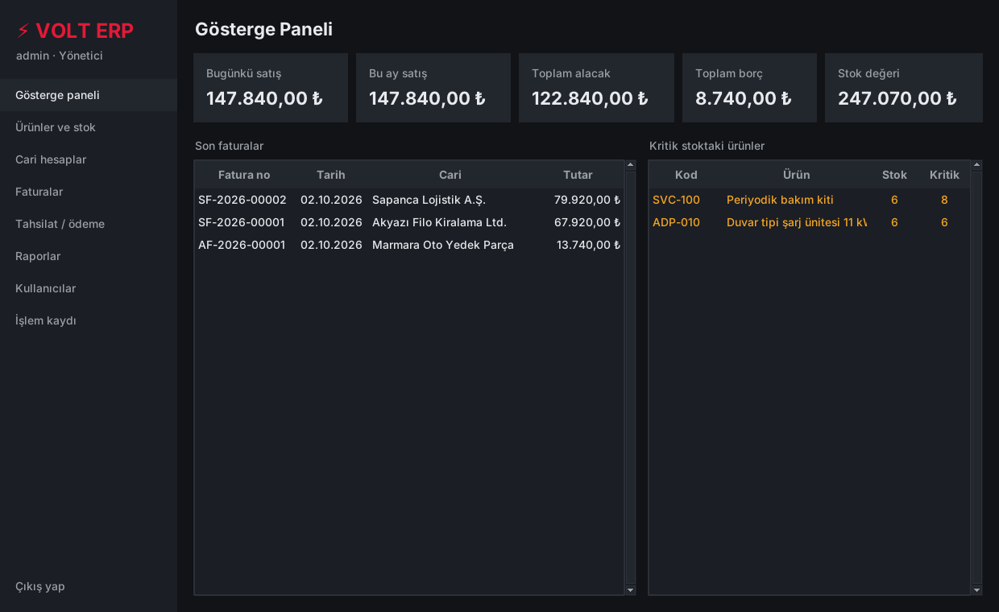
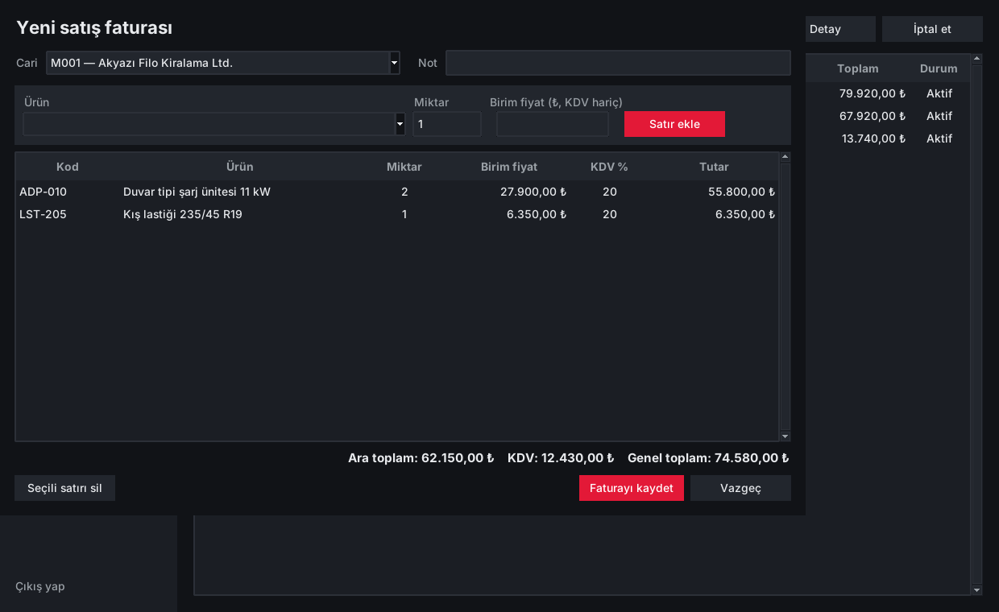

# ⚡ VOLT ERP
Küçük ve orta ölçekli işletmeler için geliştirdiğim masaüstü **ERP (kurumsal kaynak planlama)** uygulaması. Stok, cari hesap, satış/alış faturası, tahsilat/ödeme ve raporlama süreçlerini tek bir uygulamada, rol tabanlı yetkilendirmeyle yönetir.

Python standart kütüphanesi dışında hiçbir bağımlılığı yoktur. Kurulum gerektirmez, tek dosyadan çalışır.

   

## Özellikler

| Modül | Ne yapıyor |
| --- | --- |
| **Gösterge paneli** | Günlük ve aylık satış, toplam alacak/borç, stok değeri, son faturalar ve kritik stok uyarıları |
| **Ürün ve stok** | Stok kartları, KDV oranı, kritik stok seviyesi, açıklama zorunlu stok düzeltme, ürün bazında stok hareket geçmişi |
| **Cari hesaplar** | Müşteri/tedarikçi kartları, anlık bakiye, yürüyen bakiyeli **cari ekstre** ve CSV'ye aktarım |
| **Faturalar** | Satış ve alış faturası, otomatik numaralandırma (`SF-2026-00001`), satır bazında KDV, stok kontrolü, gerekçeli iptal (silme yok, ters kayıt) |
| **Tahsilat / ödeme** | Nakit, havale/EFT, kredi kartı, çek; cari bakiyeye otomatik yansır |
| **Raporlar** | Stok değeri, kritik stok, cari bakiye, aylık satış özeti, en çok satan ürünler. Tümü Excel uyumlu CSV olarak dışa aktarılabilir |
| **Kullanıcılar** | Yönetici, Muhasebe, Satış ve Depo rolleri; geçici şifre ve ilk girişte zorunlu şifre değişimi |
| **İşlem kaydı** | Giriş denemeleri, fatura, iptal ve stok düzeltmeleri gibi tüm kritik işlemlerin kim/ne zaman kaydı |
   

## Teknik tasarım

- **Katmanlı yapı:** İş kuralları (`ERP` sınıfı) arayüzden tamamen ayrıdır. Bu sayede tüm iş mantığı arayüz açılmadan test edilebilir.
- **Veri bütünlüğü:** Fatura, iptal ve stok işlemleri tek bir **transaction** içinde yapılır. Örneğin stok yetersizse fatura, satırlar ve stok hareketleri hiç yazılmaz. Veritabanında `CHECK`, `UNIQUE` ve yabancı anahtar kısıtları vardır.
- **Para hesabı:** Tutarlar ondalık sayı (float) yerine **tamsayı kuruş** olarak saklanır, KDV yuvarlaması kontrollüdür. Böylece kuruş kayması olmaz.
- **Güvenlik:**
  - Şifreler tuzlu **PBKDF2-SHA256** (120.000 tur) ile saklanır, karşılaştırma sabit sürelidir.
  - 5 hatalı denemeden sonra hesap 5 dakika kilitlenir.
  - Tüm SQL sorguları parametrelidir (SQL injection'a karşı).
  - Her işlem sunucu tarafında rol kontrolünden geçer. Arayüzde butonun gizlenmesine güvenilmez.
- **Denetlenebilirlik:** Kayıtlar silinmez. Fatura iptali ters stok hareketi ve gerekçeyle kaydedilir.

**Kullanılan teknolojiler:** Python 3.10+, tkinter/ttk, SQLite, unittest

## Çalıştırma

```bash
python volt_erp.py            # uygulamayı açar
python volt_erp.py --demo     # örnek ürün, cari ve faturalarla açar
python volt_erp.py --test     # 16 birim testini çalıştırır
```

İlk girişte kullanıcı adı `admin`, şifre `admin123`'tür. Uygulama ilk girişte yeni şifre belirlemenizi ister.

**.exe olarak paketleme (Windows):**

```bash
pip install pyinstaller
pyinstaller --onefile --windowed --name "VOLT ERP" volt_erp.py
```

## Testler

Testler; para biçimlendirme ve KDV yuvarlamasını, giriş kilidini, şifre politikasını, rol yetkilerini, satış/alış sonrası stok ve bakiyeyi, stok yetersizliğinde geri almayı (rollback), fatura numaralandırma ve iptali, cari ekstreyi, SQL injection denemelerini ve CSV dışa aktarmayı kapsar.

```
Ran 16 tests ... OK
```

## Geliştirici

**Enes Talha Köse** · [github.com/enestalhakose](https://github.com/enestalhakose)

Sakarya'da yaşıyorum ve kendimi yazılım alanında geliştirmek istiyorum. Şu anda Karaca/Korkmaz yetkili servisinde çalışıyorum. İşletmede kullanılan servis takip uygulamasını geliştirdim. Bu projeyi, ERP süreçlerini (stok, cari, fatura, yetkilendirme) uçtan uca kurgulamak ve kurumsal yazılım geliştirme pratiklerini uygulamak için hazırladım.
